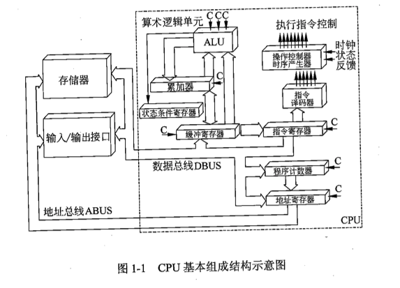

# day04

## 计算机硬件组成

## CPU（central precessing unit）,中央处理单元

CPU 基本组成结构示意图
### 运算器
- 算术逻辑单元（ALU）-> 算术运算和逻辑运算
- 累加器（AC）-> 为ALU提供工作区，操作数和运算结果
- 数据缓冲寄存器
- 状态条件寄存器
### 控制器
### 存储器

### 输入设备
用于输入原始数据与命令
### 输出设备
输出运算结果