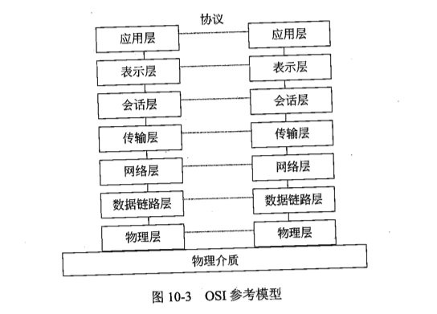
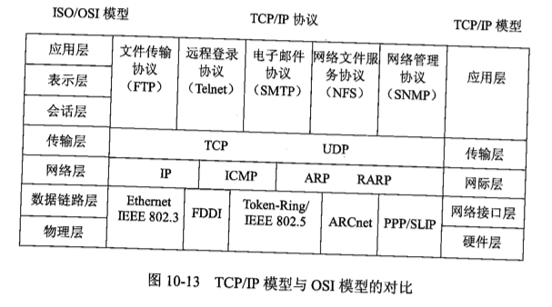

# day10
## 计算机网路

### 计算机网络的功能
1. 数据通信
2. 资源共享
3. 负载均衡
4. 高可靠性

### 计算机网络的分类
序号 | 名称 | 范围 | 传输速率
-|-|-|-
1 | 局域网（LAN）| 1km | 4Mbps~1Gbps
2 | 城域网（MAN）| 10km | 50Kbps~100Mbps
3 | 广域网（WAN）| 100km | 9.6kpbs~45Mbps

### 网络拓扑结构
序号 | 名称 | 特点
-|-|-
1 | 总线型 | 只用一个双向通路，便于广播
2 | 星型 | 中央单元负荷重
3 | 环形 | 传输效率低，难以扩充
4 | 树型 | 同总线型
5 | 分布式 | 高可靠，管理软件复杂

### OSI七层模型

层 | 协议 | 数据格式 | 应用 | 特点
-|-|-|-|-
物理层 | - | bit| - | 提供物理链接
数据链路层 | - | 帧 | - | 无差错的传输帧
网络层 | | 包 | -| 包中包含源站点和目的站点的网络地址
传输层 | TCP/IP | 报文 ||透明、可靠的传输服务
会话层 | ||| 会话管理
表示层 | ||| 数据压缩加解密等
应用层 | ||事务处理程序,电子邮件|

### 网络互联硬件

1. 中继器 （网络层）
2. 集线器（网络层）
3. 网桥（数据链路层）
4. 交换机（数据链路层）
5. 路由器（网络层）
6. 网关（应用层）

### 网络协议
